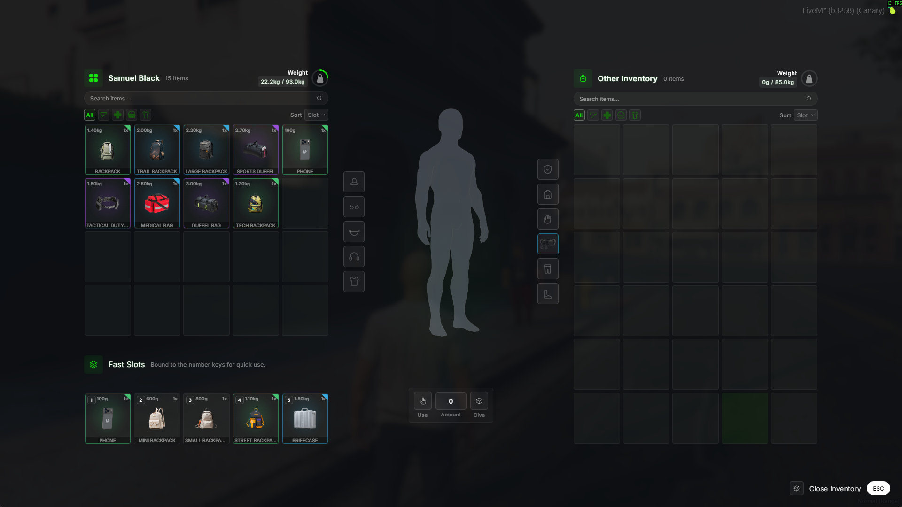
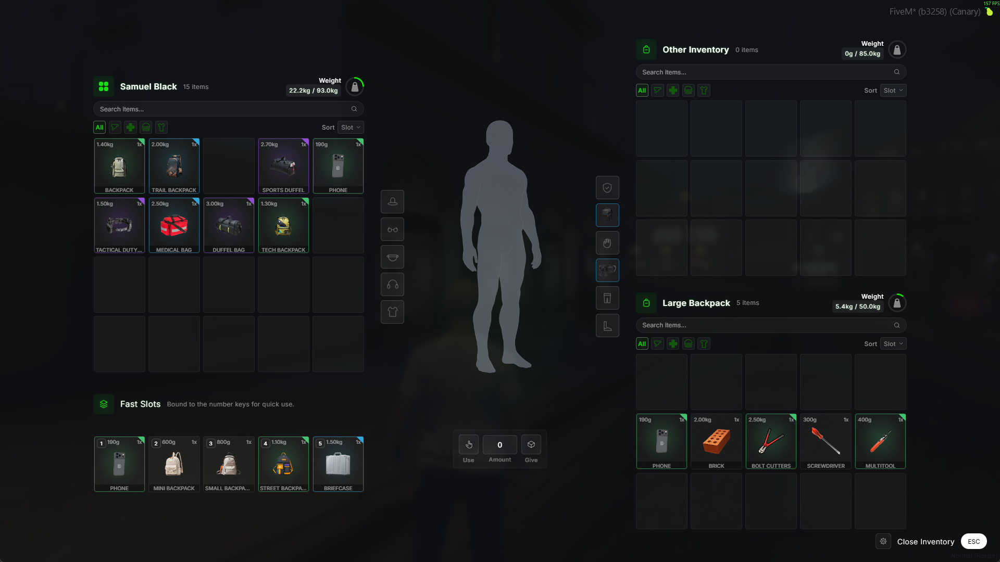
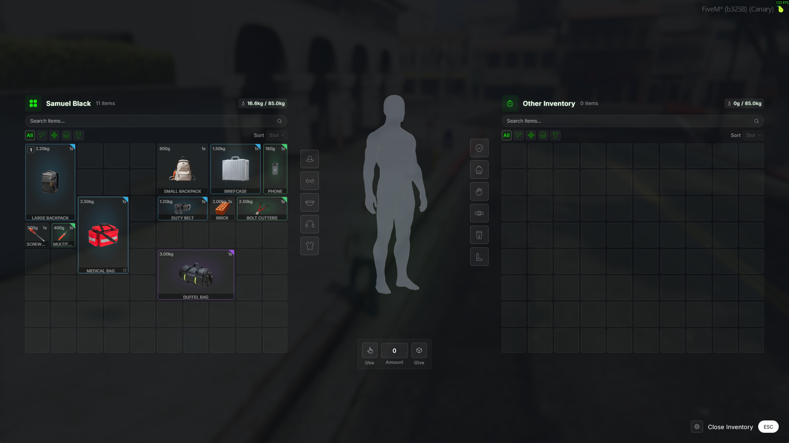
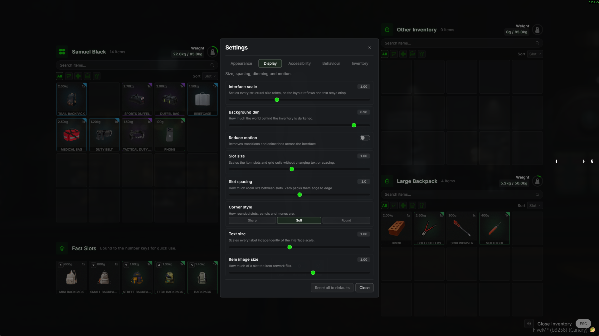

<div align="center">

# ox_inventory (SD UI)

**A rebuilt interface for [ox_inventory](https://github.com/CommunityOx/ox_inventory).**
Equipment slots, backpacks that open as a separate stash panel below the other inventory, item rarities, your choice of a slot or grid inventory, and a settings panel players can tune themselves.

Everything from upstream ox_inventory still works: items, weapons, shops, stashes, crafting, and the same exports. Only the interface and the systems listed below are new.

[](https://github.com/Samuels-Development/ox_inventory/releases)
[](https://github.com/Samuels-Development/ox_inventory)
[](https://discord.gg/FzPehMQaBQ)
[](LICENSE)


[**Store**](https://fivem.samueldev.shop) · [**Discord**](https://discord.gg/FzPehMQaBQ) · [**Upstream docs**](https://coxdocs.dev/ox_inventory)

</div>

---

> [!IMPORTANT]
> **Download the packaged `ox_inventory.zip` from [releases](https://github.com/Samuels-Development/ox_inventory/releases), not the source.**
> The green **Code > Download ZIP** button gives you source only. `web/build/` is gitignored, so the interface will not load. If you did clone the source, [build it yourself](#building-from-source).

## Preview









## What this fork adds

| | |
|---|---|
| **Equipment slots** | Eleven wearable slots around a character figure: hat, glasses, mask, earpiece, torso, armour, backpack, gloves, belt, legs, shoes. Items declare which slot they fit. |
| **Backpacks** | Equip a bag in the backpack slot and it opens as a separate panel below the other inventory, working like a stash you carry around with you. It has its own slot count and weight limit, on top of what the player can already carry. |
| **Item rarities** | Six tiers that colour the slot border and tooltip. Sorting and filtering understand them. |
| **Slot or grid inventory** | Pick one. Slots is the classic fixed-slot inventory. Grid is a Tarkov style inventory where every item occupies a footprint in cells and can be rotated. |
| **Settings panel** | Players tune scale, spacing, contrast, fonts, tooltips, notifications and colour theme in game. Preferences persist per character. |
| **Injury markers** | Optional overlay marking wounds on the character figure by body part, type and severity. |
| **Fast slots** | The first five slots surfaced as a labelled quick-use row bound to the number keys. |
| **Colour themes** | Seven presets plus full custom colour overrides. |
| **Resolution independent** | Every size derives from a viewport unit, so the interface holds its proportions from 1080p to ultrawide. |

## Configuration

Everything below lives in **`data/ui.lua`**.

### Layout

```lua
layout = 'slots',   -- 'slots' | 'grid'
```

Pick one or the other. `slots` is the classic fixed-slot inventory, where a slot holds one item whatever its size. `grid` is a Tarkov style inventory, where every item occupies a footprint measured in cells:

```lua
grid = {
    columns = 10,
    rows = 8,
    containerRows = 8,
    allowRotate = true,
    defaultSize = { 1, 1 },
    defaults = {
        weapon    = { 2, 2 },
        ammo      = { 1, 1 },
        component = { 1, 1 },
        tint      = { 1, 1 },
    },
},
```

| Field | Purpose |
|---|---|
| `columns` | Cells across, clamped to 5 through 14. |
| `rows` | Grid layout only. The player inventory becomes `rows * columns` cells, replacing the `inventory:slots` convar. Equipment slots are still appended on top. |
| `containerRows` | Grid layout only. Every stash, trunk, glovebox, drop and container becomes `containerRows * columns` cells, replacing its registered slot count. |
| `allowRotate` | Lets players rotate an item with <kbd>R</kbd> while dragging. |
| `defaults` | Fallback footprint by item class when an item declares no `grid` of its own. |

**Why `rows` and `containerRows` exist.** In slots layout a slot holds one item whatever its size. In grid layout a 2x3 backpack eats six cells. Reusing the same numbers would quietly shrink every inventory on the server the moment you switch, so grid layout sizes the player inventory from `rows` and every container from `containerRows`. Both apply only when `layout = 'grid'`; slots layout keeps using `inventory:slots` and each container's registered count untouched.

Keeping `rows` and `containerRows` equal gives both panels the same dimensions, so the two sides of the interface stay symmetrical. Set `containerRows` lower if you would rather stashes were smaller than the player inventory.

> [!WARNING]
> Switching an existing server from `slots` to `grid` does not reflow inventories that already have items in them. Positions were assigned under the old layout and will overlap. Change it on a fresh database, or expect players to rearrange.

### Equipment slots

```lua
clothing = {
    enabled = true,
    slots = {
        { name = 'hat',      label = 'Hat',      side = 'left'  },
        { name = 'backpack', label = 'Backpack', side = 'right' },
        { name = 'belt',     label = 'Belt',     side = 'right' },
    },
},
```

`side` puts the slot in the column to the left or right of the character figure. Order in the table is display order.

**Adding a slot** takes three steps:

1. Add the entry to `clothing.slots` in `data/ui.lua`.
2. Give it an icon in `web/src/components/utils/icons/ClothingIcons.tsx`, adding your component to the `CLOTHING_ICONS` map under the same `name`. This is optional: an unmapped slot falls back to a generic glyph.
3. Rebuild the interface (`cd web && npm run build`).

Slot count is not fixed, but each slot is one more reserved slot on every player inventory, so keep it deliberate.

### Rarities

```lua
rarity = {
    enabled = true,
    default = 'common',
    tiers = {
        common    = { label = 'Common',    color = '#9CA3AF', order = 1 },
        uncommon  = { label = 'Uncommon',  color = '#4ADE80', order = 2 },
        rare      = { label = 'Rare',      color = '#38BDF8', order = 3 },
        epic      = { label = 'Epic',      color = '#A855F7', order = 4 },
        legendary = { label = 'Legendary', color = '#F59E0B', order = 5 },
        mythic    = { label = 'Mythic',    color = '#FB7185', order = 6 },
    },
},
```

`order` drives rarity sorting and the tooltip bar, so keep it sequential. Any item without a `rarity` falls back to `default`. Add or rename tiers freely: the interface reads this table rather than a hardcoded list.

### Themes

`theme` picks the active preset from `themes`. Seven ship by default (`white`, `yellow`, `orange`, `red`, `purple`, `blue`, `green`) and players can override individual colours from the settings panel.

## Defining items

Items live in **`data/items.lua`**. Beyond the stock ox_inventory fields, this fork reads `rarity`, `grid` and `clothing`.

```lua
['trail_backpack'] = {
    label = 'Trail Backpack',
    weight = 2000,
    stack = false,
    close = false,
    consume = 0,
    rarity = 'rare',            -- tier key from ui.lua
    grid = { 2, 3 },            -- { width, height } in cells, grid layout only
    clothing = 'backpack',      -- equipment slot this item occupies
    description = 'Weatherproof shell, hip belt, and enough straps to lose a thumb in.',
},
```

| Field | Purpose |
|---|---|
| `rarity` | Tier key from `ui.lua`. Colours the slot border and tooltip. Omit for `common`. |
| `grid` | `{ width, height }` in cells. Only used by the `grid` layout; ignored in `slots`. |
| `clothing` | Equipment slot name, or a table of names when an item fits more than one. Validated against `ui.lua` at startup, and a bad value is reported in console. |
| `client.image` | Optional. **Omit it** when the image is named after the item: the interface falls back to `web/images/<item name>.png` on its own. |

### Item images

Drop a PNG into `web/images/` named after the item (`trail_backpack.png`) and it resolves automatically. The house size is **100 x 100 RGBA**, though the interface scales anything with `object-fit: contain`, so a different size will still fit, just with letterboxing.

### Containers

A container item opens a second inventory. Register it in **`modules/items/containers.lua`**:

```lua
setContainerProperties('trail_backpack', {
    slots = 26,
    maxWeight = 45000,          -- grams
    blacklist = containerItems, -- stops bags nesting inside bags
})
```

`whitelist` is the inverse and restricts a container to specific items, which is how the pizza box only ever holds pizza.

There are two ways a container can behave, and the only difference is whether it declares a `clothing` field.

- **Equipped**, when it declares `clothing = 'backpack'`. The player wears it in the backpack slot, and it opens automatically as a separate stash panel below the other inventory every time they open their inventory. Nothing to click.
- **Carried**, when it declares no `clothing` field. It sits in the inventory grid taking up space like any other item, and opens as a stash only when the player uses it.

### Bags that ship with this fork

Thirteen container items, all sharing one icon set.

| Item | Slots | Max load | Carry |
|---|---|---|---|
| `backpack_fashion` | 8 | 12 kg | Equipped |
| `backpack_small` | 10 | 15 kg | Equipped |
| `backpack_urban` | 16 | 25 kg | Equipped |
| `backpack_gamer` | 18 | 28 kg | Equipped |
| `backpack_medium` | 20 | 30 kg | Equipped |
| `backpack_hiking` | 26 | 45 kg | Equipped |
| `backpack_large` | 30 | 50 kg | Equipped |
| `duffel_bag_sport` | 36 | 65 kg | Equipped |
| `duffel_bag` | 40 | 70 kg | Equipped |
| `briefcase` | 12 | 20 kg | Carried |
| `medic_bag` | 20 | 30 kg | Carried |
| `police_duty_belt` | n/a | +8 kg carry weight | Equipped, belt slot |
| `police_duty_belt_heavy` | n/a | +14 kg carry weight | Equipped, belt slot |

The two duty belts are worn kit rather than storage. Instead of opening a stash they raise how much the player can carry while equipped, applied as a delta so bonuses set by other resources survive. Tune the amounts in `beltCapacity` in `modules/inventory/server.lua`.

## Installation

### Dependencies

| Resource | What it is for |
| --- | --- |
| [ox_lib](https://github.com/CommunityOx/ox_lib) | Shared library |
| [oxmysql](https://github.com/CommunityOx/oxmysql) | Database access |

### Supported frameworks

[ox_core](https://github.com/communityox/ox_core), [esx](https://github.com/esx-framework/esx_core), [qbox](https://github.com/Qbox-project/qbx_core), [nd_core](https://github.com/ND-Framework/ND_Core), and QBCore. Compatibility with third-party resources is not guaranteed.

### Steps

1. Download `ox_inventory.zip` from [releases](https://github.com/Samuels-Development/ox_inventory/releases) and extract it into your resources folder.
2. Start it after its dependencies:

```cfg
ensure ox_lib
ensure oxmysql
ensure ox_inventory
```

3. Adjust `data/ui.lua` to taste. Nothing there is required to boot.

### Building from source

Cloned the repo instead of using a release? `web/build/` is gitignored, so build the interface yourself:

```bash
cd web
npm ci
npm run build
```

Rebuild after **any** change under `web/`, including `data/ui.lua` edits that add an equipment slot needing a new icon.

## Staying current with upstream

This fork tracks [CommunityOx/ox_inventory](https://github.com/CommunityOx/ox_inventory).

A scheduled workflow (`.github/workflows/upstream-sync.yml`) checks upstream daily and opens a pull request when it is ahead, so updates arrive as a reviewable diff rather than a surprise. You can also run it on demand from the Actions tab.

To pull updates by hand:

```bash
git remote add upstream https://github.com/CommunityOx/ox_inventory.git
git fetch upstream
git merge upstream/main
```

> [!NOTE]
> Expect conflicts in `web/`. The interface here is a rewrite, so upstream changes to their UI rarely apply cleanly. Server and shared Lua usually merges without trouble.

## Credits

- **[Overextended](https://github.com/overextended)** wrote the original ox_inventory, and this is still their resource underneath.
- **[CommunityOx](https://github.com/CommunityOx/ox_inventory)** maintain it now, and are the upstream this fork tracks.
- **[DemiAutomatic/ox_inv_redesign](https://github.com/DemiAutomatic/ox_inv_redesign)** is the redesign this interface grew out of.
- Bag and container icons come from **[swkeep/keep-bags](https://github.com/swkeep/keep-bags)**, used unmodified under GPL-3.0. See [`web/images/CREDITS.md`](web/images/CREDITS.md) for the per-file mapping.

## Copyright

Copyright © 2024 Overextended <https://github.com/overextended>

This program is free software: you can redistribute it and/or modify it under the terms of the GNU General Public License as published by the Free Software Foundation, either version 3 of the License, or (at your option) any later version.

This program is distributed in the hope that it will be useful, but WITHOUT ANY WARRANTY; without even the implied warranty of MERCHANTABILITY or FITNESS FOR A PARTICULAR PURPOSE. See the GNU General Public License for more details.

You should have received a copy of the GNU General Public License along with this program. If not, see <https://www.gnu.org/licenses/>.
